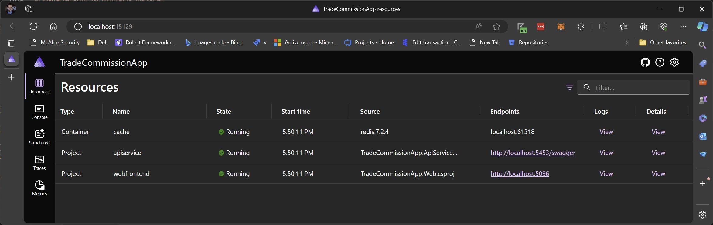
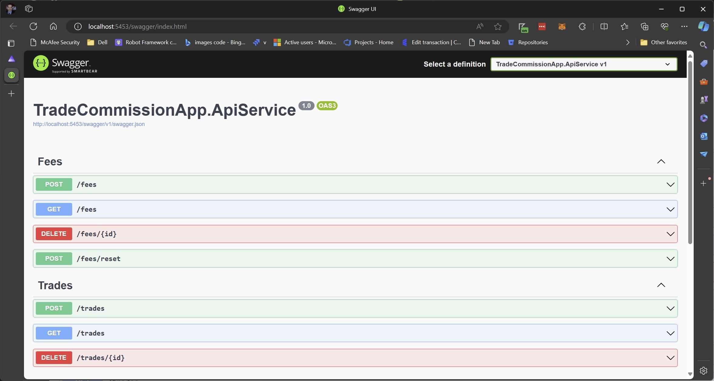
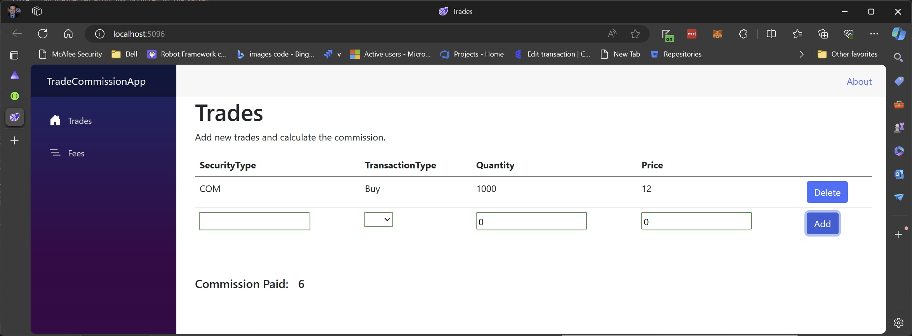

# Commission Calculation Service

This project started as a coding assignment given to me as part of a job interview. I have expanded beyond the basic premise to turn it into a collection of microservices. My intent was to create a small showcase of my ability and to demonstrate my familiarity with C#, asynchronous programming, thread-safety, microservices, containerization, unit testing, Domain Driven Design, and DevOps.

The project took between 18 to 22 work-hours including design, coding, testing, and documentation.

## Original Assignment
Design and implement a Trade Commission calculation service. This service will accept data for multiple
financial trades and return the total commission amount. Design the service to have the ability to calculate the commission for the specified trades in parallel with a maximum of 10 trades processed at a time.

A detailed description of the problem can be found in the [Documentation](Documentation/ProblemDescription.md) folder.

## Assignment Solution
The solution to the stated problem can be found in the [CalculationService](TradeCommissionApp.CalculationService/CommissionCalculationService.cs). This code can be easily exercised by running the unit tests found within the [Tests](Tests/CalculationService.Tests/CommissionCalculationServiceTests.cs) folder. 

Specifically, the following test will validate the example shown in the [problem description](Documentation/ProblemDescription.md):
https://github.com/LordGriz/TradeCommissionApp/blob/787eff5a6ac50a7e8cabd8a12d0ada444ff0a12d/Tests/CalculationService.Tests/CommissionCalculationServiceTests.cs#L43C5-L65C1

## Project Architecture 
This overall project is a [.NET Aspire](https://learn.microsoft.com/en-us/dotnet/aspire/get-started/aspire-overview) application. The solution contains a number of projects to ensure separation of concerns. Each service in the application is designed to run in its own container so it could be easily deployed to a cloud hosting service. The purpose and design of each component is summarized below.

### [Domain](/Domain/)
This library contains all the Entities, ValueObjects, and business logic needed to operate within the application domain. Any names or logic found here should be immediately recognizable to the Product Owners. Ideally 'ubiquitous language' should be used which is understandable from a business context. An example can be seen in the [Fee](Domain/Objects/Fee.cs) domain object.

This Domain library could be maintained separately for use across different applications within a business unit.

### [Infrastructure](/Infrastructure/)
As indicated by its name, this library contains all code related to the infrastructure used by the services. In this particular case it simply contains the concrete repository objects which implement the [contracts contained in the Domain project](Domain/Contracts/). This is done to ensure the services need not know about the database implementation. In this way, the database layer could be entirely replaced (e.g. moving from a SQL to a NoSql database) without affecting the other projects.

The repositories defined in the Infrastructure library use the Entity framework to store the data in a local flat file database. This is only done for the sake of simplicity of this project.

### [TradeCommissionApiTypes](/TradeCommissionApiTypes/)
The types defined in this library are for the Json messages used for comunication by the services. Each request/response type also contains the logic to create the appropriate Domain object:

https://github.com/LordGriz/TradeCommissionApp/blob/787eff5a6ac50a7e8cabd8a12d0ada444ff0a12d/TradeCommissionApiTypes/FeeRequest.cs#L27C5-L30C6

### [TradeCommissionApp.ApiService](/TradeCommissionApp.ApiService/)
A custom web api service which is used to interact with the application database. The other services access the Database through this Api. The project makes use of both the Domain and Infrastructure libraries to respond to HTTP requests sent by the caller. This design allows for the additional spinning up of Api service containers during periods of high database activity without the need to increase the number of CPUs running in the web front-end. This is of course also limited by the number of simultaneous requests the database can handle.

Further, here a single Api service is handling both Fee and Trade calls for a single database. Depending on performance considerations, it may make sense to split up the apis into two services and, perhaps, even split the database itself. 

### [TradeCommissionApp.AppHost](/TradeCommissionApp.AppHost/)
This project is standard in .NET Aspire and is only meant to be used during development. It is an application orchestrator which allows a view into the distributed services. A link to each endpoint is provided along with links to the logs and metrics of each service. 

Each service in this application uses [OpenTelemetry](https://learn.microsoft.com/en-us/dotnet/core/diagnostics/observability-with-otel) for gathering logs and metrics. The AppHost project is meant to take the place of something like Elastic Search during development. A screenshot can be seen in the "Running from Visual Studio" section below.

### [TradeCommissionApp.CalculationService](/TradeCommissionApp.CalculationService/)
The service contains the application logic which processes Domain Objects to calculate the total commission. The service itself has no knowledge of how a commission is calculated, and simply sums the totals it's given by the Fee object.

The calculation service may use a large number of threads (cpus) so it is maintained as a separate api service. It connects to the [TradeCommissionApp.ApiService](TradeCommissionApp.ApiService/TradesRouteConfiguration.cs) instead of directly to the database.

The CalculationService uses its own implementation of an [IFeeRepository](/Domain/Contracts/IFeeRepository.cs) object called [HttpFeeRepository](/TradeCommissionApp.CalculationService/Repositories/HttpFeeRepository.cs) which makes calls the the Api service rather than the database directly. This was mostly done to demonstrate the ease at which the backing technology can be swapped without requiring a large rewrite of the code. 

### [TradeCommissionApp.Web](/TradeCommissionApp.Web/)
The front-end web application communicates directly with the ApiService to perform all actions. The application is written using server side Blazor, however, it could be easily ported to a WebAssembly.

Since the project uses Http for communication rather than direct calls to the database, it can more easily swapped a project written with a different technology (such as React) if the need should arise.

## Running the application

### Setup
#### Install Prerequisites

1. Install .NET 8.0.2. The latest versions can be found at https://dotnet.microsoft.com/en-us/download/dotnet/8.0. 
2. Install Docker Desktop from https://docs.docker.com/desktop/install/windows-install/

   > Note: Docker Desktop is not needed to run the unit tests, but is required to run the full application. 

### Running from Visual Studio

To run the full services (and not just the unit tests) the .Net Aspire workload must first be installed in Visual Studio. Directions to do so can be found at https://learn.microsoft.com/en-us/dotnet/aspire/fundamentals/setup-tooling?tabs=windows&pivots=visual-studio

#### AppHost
AppHost must be the startup project. Running the full application in Visual Studio should open a new browser window pointing to TradeCommission.AppHost. This orchestrator page will display the following table of running services, their logs, and their metrics:

> Note: If the page does not display any services, stop and restart the app. There seems to be a bug outside of my code which I haven't yet investigated.

#### ApiService
Browsing to the **apiservice** endpoint will bring the developer to the Swagger page which can be used to send Api requests to the running instance. A similar page appears for the **calculationservice** 

#### Frontend
Browsing to the **webfrontend** endpoint will bring the developer to the front end Blazor application. The user can add and delete trades or fees, and see the commission. The application is not too robust as it is a POC, however, it does have basic validation.

