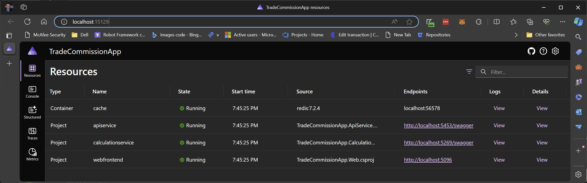

# Commission Calculation Service

## Assignment
Design and implement a Trade Commission calculation service. This service will accept data for multiple
financial trades and return the total commission amount.

A detailed description of the problem can be found [here](Documentation/ProblemDescription.md).

## Solution
The [CalculationService](CalculationService) contains the code for determining the total commission. This code can be easily exercised by running the unit tests found within the [Tests](Tests) folder. 

## Project Architecture 
This project is  a [.NET Aspire](https://learn.microsoft.com/en-us/dotnet/aspire/get-started/aspire-overview) application. The application contains a number of projects to ensure separation of concerns, but I've called out several of the most important ones below. The details have been purposefully left sparse in order to spur conversation.

### Domain
This library contains all the Entities, ValueObjects, and business logic needed to operate within the application domain.

### CalculationService
The service contains the application logic which processes Domain Objects to calculate the total commission. The service itself has no knowledge of how a commission is calculated, and simply sums the totals it's given. 

### TradeCommission.AppHost
An application orchestrator with allows a view into the distributed services. A link to each endpoint is provided along with links to the logs and metrics of each service. This project is standard in .NET Aspire.

### TradeCommission.ApiService
An custom web api service which is used to interact with the application database. It makes use of both the Domain and Infrastructure libraries to respond to HTTP requests sent by the caller.

### TradeCommission.Web
The front end web application which communicates directly with the ApiService.  The application is written using server side Blazor, however, it could be easily ported to a WebAssembly.

## Running the application

### Setup
#### Install Prerequisites

1. Install .NET 8. The latest version can be found at https://dotnet.microsoft.com/en-us/download/dotnet/8.0. 
2. Install Docker Desktop from https://docs.docker.com/desktop/install/windows-install/

   > Note: Docker Desktop is not needed to run the unit tests, but is required to run the full application. 

### Running from Visual Studio

#### AppHost
Running the full application in Visual Studio should open a new browser window pointing to TradeCommission.AppHost. This orchestrator page will display the following table of running services, their logs, and their metrics:

> Note: If the page does not display any services, stop and restart the app. There seems to be a bug outside of my code which I haven't yet investigated.

#### ApiService
Browsing to the **apiservice** endpoint will bring the developer to the Swagger page which can be used to send Api requests to the running instance.

#### Frontend
Browsing to the **webfrontend** endpoint will bring the developer to the front end Blazor application. The user can add and delete trades or fees, and see the commission. The application is not too robust as it is a POC, however, it does have basic validation.

